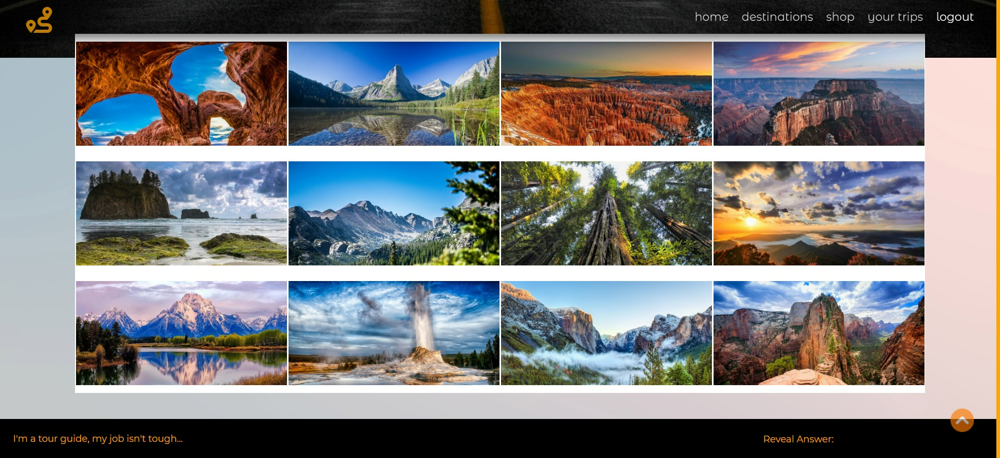
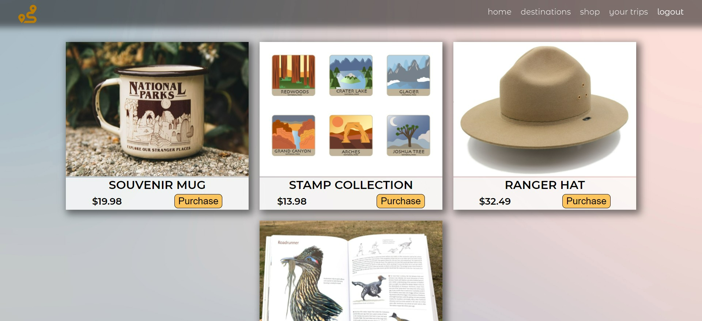

# National-Parks-Roadtrip
    

## Link to Site

[Link to live site!](https://national-park-roadtrip.herokuapp.com/)

  
## Description
This web application allows you to create your own itinerary based on the national parks you would like to visit. Without logging in, you can visit the parks pages and see the weather, location, and activities connected to that specific park.  We also provide beautiful photographs to help you select your next destination.  When you create your own login, you can save the parks that you would like to visit and delete the park you have already visited from your itinerary. 
 
  
## Table of Contents
  - [Usage](#Usage)
  - [Installation](#Installation)
  - [Usage](#Usage)
  - [Contributing](#Contributing)
  - [Screenshots](#Screenshots)
  - [Credits](#Credits)
  - [License](#License)
  - [Github](#Questions)
  
## Usage
Visit the applications webpage and follow the links in the header to navigate the app! 
  
## Contributing 
If you would like to contact us to make suggestions, please contact us through the GitHub repo.
  

## Screenshots

## Credits
  Alex Wilson, Laura Wiener, Thurston Cox, Yinping Gao, Ashby Blakely
  
  ## License 
  [Link to the MIT license used](https://opensource.org/licenses/MIT)  
  
 
## GitHub
  [Link to GitHub Repo](https://github.com/AlexWilsonNC/national-roadtrip) 

